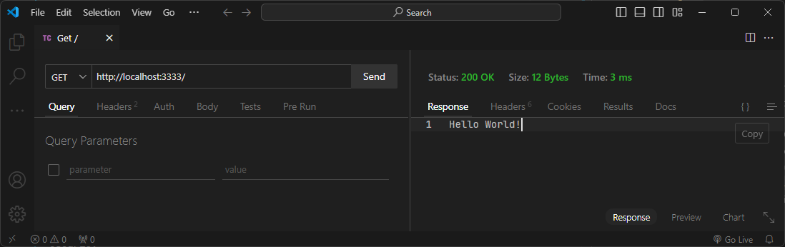

# API-TypeScript-MongoDB

API desenvolvida em TypeScript para gerenciamento de usuários, integrando MongoDB como banco de dados. O projeto adota o padrão de design denominado **Repository Pattern**, um padrão arquitetural que abstrai a lógica de acesso a dados em repositórios, oferecendo uma interface consistente e desacoplada para interagir com o banco. Com controllers organizados e aplicação estruturada em classes, o projeto foca em boas práticas de desenvolvimento, escalabilidade e aprendizado aprofundado na criação de APIs robustas e modulares.

### Funcionalidades Implementadas

1. `**Post (Criar)**`: Permite adicionar novos usuários ao banco de dados.
2. `**Get (Pegar)**:` Retorna todos os usuários existentes ou somente o usuário específicado pelo ID.
3. `**Update (Atualizar)**`: Modifica os dados de um usuário existente com base em seu ID.
4. `**Delete (Excluir)**`: Remove um usuário do banco de dados com base no ID fornecido.

### Tecnologias Utilizadas

- `Node.js`
- `TypeScript`
- `Express`
- `MongoDb`
- `Eslint`
- `Git - GitHub`

### Estrutura do Projeto

- `src/index.ts`: Arquivo principal.
- `src/controllers`: Local onde é armazenado todas as controllers para cada função e as interfaces padronizadas.
- `src/server/database`: Arquivo que configura o objeto de conexão com o banco de dados e o disponibiliza para toda a aplicação.
- `src/server/models`: Arquivo define e padroniza a tipagem de cada instancia de usuário.
- `src/server/repositories`: Local onde é armazenado cada repository para cada controller ou função.
- `src/server/routes`: Definição de cada rota e instancia de cada controller e repository.

### Imagens

#### `Get/`:

#### `Get/users`:

#### `Post/`:

#### `Put/:id`:

#### `Delete/:id`:

# 
### Este projeto foi desenvolvido por [Júlio Elias de Sousa Rocha](https://github.com/Juliowk).